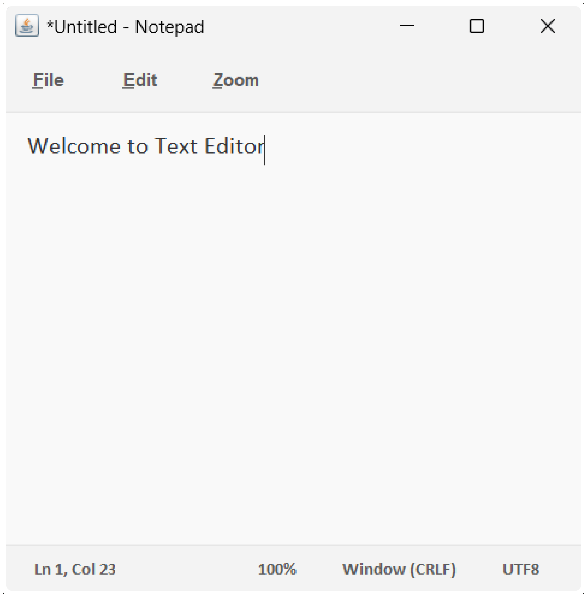

# 📝 Java Text Editor

A lightweight, custom-built **Text Editor** developed in **Java**, designed to provide essential file editing capabilities with a user-friendly GUI. Inspired by traditional editors like Notepad, but created from scratch as a core Java GUI project.


## 🚀 Technologies Used
- Java SE
- Swing (Java GUI)
- AWT (Abstract Window Toolkit)

## ✨ Features
- Create, open, save `.txt` files
- Basic text editing: cut, copy, paste, select all
- UI built using **Swing** components
- Scrollable, resizable window
- Keyboard shortcuts for common actions

## 🧰 Setup & Run Instructions
```bash
# Compile the Java file
javac TextEditor.java

# Run the application
java TextEditor


# Welcome to TextEditor

-   This TextEditor is build in java using it's framework like `swing` & `awt`
-   It provide features like:
    -   Editing text in file.
    -   Save text into file.
    -   Open existing file or create new one.
    -   Provide facility of printing the document.
    -   It gives the information about the type of encoding applied on the document.
    -   Can load file upto 20 MB.

## How to run.

#### Run the application [`TextEditor.jar`](TextEditor.jar) directly on your PC without compiling the code.

<hr />

### Or run the following commands in the terminal.

First current working directory to `src` directory:

```powershell
cd src
```

Then run the following command to delete all the `*.class` files and compile the `*.java` file to `*.class` file and run the class file.

```powershell
cls;del ./**/*.class;del ./*.class;javac App.java; if ($?) { java App; }
```

### Text Editor Image :


